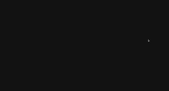
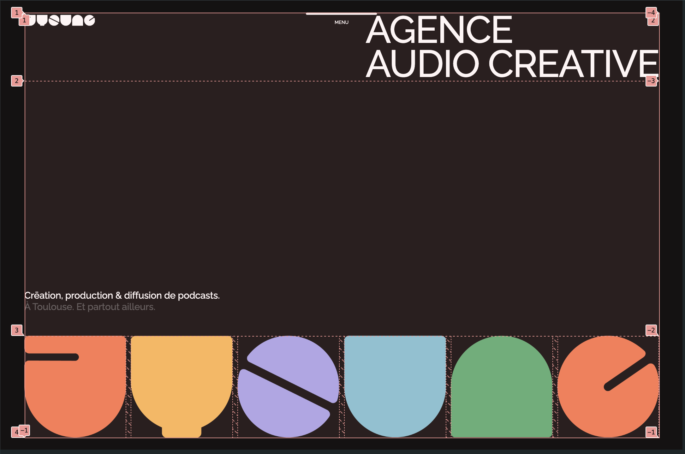

# GSAP를 활용한 애니메이션 실습 프로젝트

## 📝 프로젝트 소개

애니메이션 라이브러리인 GSAP를 활용하여 사용자 경험 개선을 목표로 실습한 프로젝트입니다. 패럴랙스 이펙트, 마우스 오버효과, 3D 이펙트 등의 다양한 인터랙티브 요소를 신경써서 제작했습니다.

> [배포 링크 보러가기](https://gsap-mu.vercel.app/)

<br/>

## 👀 미리보기



<br/>

## 🛠️ 개발 스택

- TypeScript
- React.js
- styled-components
- gsap

<br/>

## 📁 구현 사항

### grid와 flex를 사용한 레이아웃



<br/>

### 스크롤에 반응하는 패럴랙스 효과

- ScrollTrigger 플러그인을 사용하여 사용자가 스크롤을 올리거나 내릴 때 나오는 애니메이션을 구현
- 요소마다 delay, duration 등의 속성을 사용하여 애니메이션마다 디테일한 동작을 부여

```ts
gsap.timeline({
  scrollTrigger: {
    trigger: "#visual",
    start: "100% 100%",
    end: "100% 0%",
    scrub: 1,
  },
});
```

<br/>

### 3D 패럴랙스 효과

- perspective 속성을 사용하여 3차원 UI를 제작, 스크롤 위치에 따라 z축을 회전시켜 애니메이션 효과를 구현

```ts
const StyledList = styled.ul`
  margin: 100px 0;
  perspective: 900px;
`;

ScrollTrigger.create({
  trigger: selector as HTMLElement,
  start: "30% 50%",
  onEnter: () => {
    gsap.set(selector as HTMLElement, {
      rotationX: "-65deg",
      z: "-500px",
      opacity: 0,
    });

    gsap.to(selector as HTMLElement, {
      rotationX: 0,
      z: 0,
      opacity: 1,
      delay: (index % 3) * 0.05,
    });
  },
});
```

<br/>

### 마우스 이펙트

- 마우스오버 이벤트가 발생할 때 이미지가 마우스 커서를 따라다니는 효과를 구현

```ts
const imgBox = gsap.utils.toArray("#con5 .imgBox")[0] as HTMLElement;
const img = gsap.utils.toArray("#con5 .imgBox img")[0] as HTMLImageElement;

return gsap.utils.toArray("#con5 .listBox li").forEach((selector, index) => {
  (selector as HTMLElement).addEventListener("mouseover", () => {
    img.src = `/assets/img${index}.jpg`;
    img.alt = `img${index}`;

    gsap.set(imgBox, { scale: 0, opacity: 0, duration: 0.3 });
    gsap.to(imgBox, { scale: 1, opacity: 1, duration: 0.3 });
  });

  (selector as HTMLElement).addEventListener("mousemove", (e) => {
    const imgBoxX = e.pageX + 20;
    const imgBoxY = e.pageY - 20;

    imgBox.style.left = `${imgBoxX}px`;
    imgBox.style.top = `${imgBoxY}px`;
  });

  (selector as HTMLElement).addEventListener("mouseout", () => {
    gsap.to(imgBox, { scale: 0, opacity: 0, duration: 0.3 });
  });
});
```
